linux-network-programming
---


## 主机字节序与网络字节序

对于跨越多个字节的程序对象，我们必须建立两个规则：这个对象的地址是什么？以及在内存中如何排列这些字节。在几乎所有的机器上，多字节对象都被存储为连续的字节序列，对象的地址为所使用的字节中最小的地址。


计算机中一个整数的字节序分为大端字节序(big endian)与小端字节序(little endian)。大端字节序是指一个整数的高位字节存（`23~31` bit）储在内存的低地址处，低位字节（`0~7` bit）存储在内存的高地址处。而小端法则刚好相反。

现代PC大多采用小端字节序，因此小端字节序被称为主机字节序。而一般两台计算之间通信，我们必须约束好彼此双方发送信息时使用的字节序，一般约定为使用大端字节序，所以我们一般把大端字节序称为网络字节序。

大端法符合人们的读写顺序，而小端法则适合计算机的计算，计算机的电路先处理低字节会比较高效。

> 大端与小端源于对鸡蛋该从哪一端打开的争论

需要注意的大小端的问题只针对计算该如何解析内存中的整数，而对于浮点数、字节流等数据是不存的。操作系统提供了4个函数（`htonl`/`ntohl`/`htons`/`ntohs`），分别用于`uint16/unsigned short`以及`uint32/unsigned long`类型的整数在主机字节序与网络字节序之间的转换。这4个函数存在头文件`netinet/in.h`中。

主机大小端判断以及主机与网络序转换的示例程序：[socket-api/big_little_endian.c](socket-api/big_little_endian.c)

## Socket API

Linux的网络API可以分类3类：

- socket地址API，主要描述通过什么样的数据结构来描述一个socket的地址`(ip, port)`
- socket基础API，包括了socket创建、关闭、命名、监听、接受连接、发起连接、发送与接收数据以及读取和设置socket的选项。
- 网络信息API，它提供了ip地址和域名、端口号和服务名之间的转换

### Socket地址

### Socket地址的结构

目前常见的协议族的定义如下：

协议族 | 地址族 | 描述 | 地址值的含义
:---: | :---: | :---: | :---:
`PF_UNIX` | `AF_UNIX`| `UNIX`本地域协议族 | 文件的路径名，长度可达到108个字节
`PF_INET` | `AF_INET` | `TCP/IPv4`协议族 | 2字节的端口号和4字节的IPv4地址，共6字节
`PF_INET6` | `AF_INET6` | `TCP/IPv6`协议簇 | 2字节的端口号，4字节流标识，16字节的IPv6地址，4字节的范围ID，一共26字节。

宏`PF_*`和`AF_*`都在`bits/socket.h`头文件中，且后者与前者有完全相同的值，所以二者通常混用。

所有的socket的API中所使用的地址的结构都是通用的地址结构，即`sockaddr`，但由于`sockaddr`的结构并不能满足不同协议族的需求，所以各个协议族又定义了自己的专用地址结构，它们的关系如下图所示：

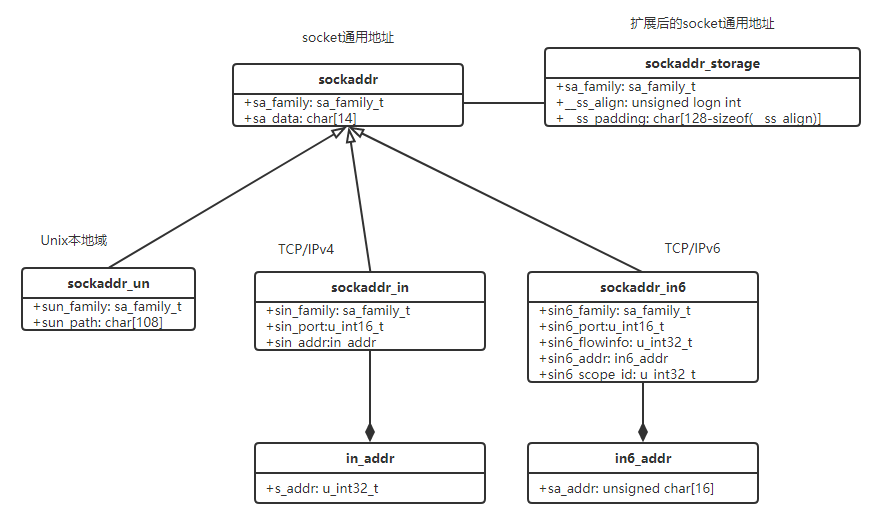

由于我们在socket API中只能使用`sockaddr`的结构，所以所有专用的地址结构，必须通过强制类型转换来转换为通用类型。

因为在socket接口设计时，那时C语言还不支持`void *`，所以为了实现一种类型的多态，所以通过这个一个通用类型的指针来占位，这里只需要通用结构里最开始有个信息能区分实际协议类型就可以了，这里也算一种c语言的技巧吧。

### 点分址进制ip字符串与网络序的IP地址之间的转换

对于ip来地，人们习惯用点分十进制来表示IPv4的地址，用十六进制字符串来表示IPv6的地址，但是在编程里，我们需要转化为整数（二进制数），
当我们需要写日志的时候，我们又需要以可读的形式来记录。

Linux Socket API提供了两组函数来提供这种转换功能，其中`inet_addr/inet_aton/inet_ntoa`应试是比较早的接口，不支持IPv4，同时还有不可重入的问题。后续应该会被弃用，新的一组接口功能强大一些。

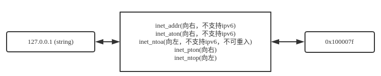

示例程序：[socket-api/ip_translation.c](socket-api/ip_translation.c)

## Socket基础API

### `socket`: 创建Socket

```c
#include <sys/types.h>
#include <sys/socket.h>

///@brief 创建socket句柄
///@param[in] domain
///用于告诉系统使用哪个底层协议族，可选的一般有：PF_INET、PF_INET6、PF_UNIX
///@param[in] type
/// 用于指定服务类型。主要类型有SOCK_STREAM，用于说明是流服务，也就是TCP连接。SOCK_DGRAM表示数据报服务，也就是UDP连接。自Linux
/// 2.6.17起，type参数可以接受上述服务类型与下面两个重要的标志相与的值。SOCK_NONBLOCK表示将新创建的socket设为非阻塞的；
/// SOCK_CLOEXEC表示用fork调用创建子进程中关闭该
/// socket。在Linux 2.6.17之前，这两个属性都需要使用额外的系统调用fcntl来设置。
///@param[in] protocol
/// 参数是在前两个参数构成的协议集合下，再选择一个具体的协议。
/// 不过这个值通过是唯一的（前两个参数已经完全全决定了它的值。）几乎在所有情况下，我们都应该把它设置为0，表示使用默认协议。
///@return
///系统成功，将返回一个文件描述系，它像其他文件描述符一样，是可读、可写、可控制、可关闭的。失败就返回-1，并设置errno。
int socket(int domain, int type, int protocol);
```

### `bind`: Socket绑定地址

当我们调用`socket()`函数创建了一个Socket后，虽然指定了地址族，但并未指定使用这个地址族中哪个具体的地址。

在服务器端程序中，我们需要指定一个具体的地址，这样与它通信的客户端才能通过这个地址来进行连接与通信。而在客户端程序中就不需要，因为操作系统会自动的分配一个socket地址（主要是端口号，地址一般就是客户端机器的IP地址）。


```c
#include <sys/types.h>
#include <sys/socket.h>

/// @brief 给一个socket文件描述符绑定一个具体的socket地址
/// @param[in] sockfd　socket的文件描述符
/// @param[in] my_addr socket的地址，这里的类型虽然为`socketaddr*`，
/// 但我们可以用专用地址(`sockaddr_in`/`sockaddr_in6`)来构建，然后再强制转换
/// @param[in] addrlen socket地址的长度
/// @retrun bind成功时返回0，失败时返回-1并设置`errno`。其中两种常见的`errno`是`EACCESS`和`EADDRINUSE`
/// `EACCESS`表示被绑定的地址是受保护的地址，仅超级用户能够访问。比如普通用户将socket绑定到知名的服务端口(0~1023)
/// `EADDRINUSE`表示被绑定的地址正在使用中。比如将socket绑定到一个处于`TIME_WAIT`状态的socket地址
int bind(int sockfd, const struct sockaddr* my_addr, socklen_t addrlen);
```
但实际中，我们写的程序后续部署的机器的IP地址是无法预先知道的，这虽然可以通过外部传入配置文件来解决，但更好的方式是，可以利用通配地址。

`INADDR_ANY`和`IN6ADDR_ANY`分别代码IPv4和IPv6的通配地址。
```c
struct sockaddr_in name;
name.sin_addr.s_addr = htonl(INADDR_ANY);
```

### `listen`: 监听socket

```c
/// @brief 给socket创建一个监听队列以存放待处理的客户连接
/// @param[in] sockfd　socket的文件描述符
/// @param[in] backlog　参数提示内核监听队列的最大长度。
/// 监听队列的长度如果超过backlog，服务器将不再受理新的客户连接，
/// 客户端也将收到`ECONNREFUSED`的错误信息。
/// 在内核版本2.2前，backlog的参数是指所有处理半连接和完全连接状态的socket的上限。
/// 内核版本2.2后，它只表示处于完全连接状态的socket的上限
/// 处于半连接状态的socket的上限则由`/proc/sys/net/ipv4/tcp_max_syn_backlog`内核参数定义
/// backlog的典型值是5
#include <sys/socket.h>
int listen(int sockfd, int backlog);
```

对于`backlog`的理解：当服务器调用`listen`后，就一直等待客户端来建立连接，这里如果客户端调用了`connect`，那么服务器端就会一连接建立的过程，这个过程会先经过`SYN_RCVD`再到`ESTABLISHED`。这些半连接和完全连接状态的连接保存在两个不同的队列中。
这时如果服务器端一直没有调用`accept`来从`ESTABLISHED`队列中取走连接来处理，那队列满后，就不能再响应连接建立了。

我们可以利用[test_listen_backlog](./socket-api/test_listen_backlog.c)程序来对`backlog`的机制进行测试

```bash
[Server] ./test_listen_backlog 10.152.26.34 23333
[Client] telnet 10.152.26.34 23333 # 执行5次以上
[Server] netstat -nt | grep 23333
```
本机测试发现，当在客户端机器上执行第7次时，会产生连接超时的问题，而并没有像书中介绍的说，会加入到`SYN_RCV`队列中。而`netstat`命令也只能显示有`ESTABLISHED`的连接，并没有`SYN_RECV`的连接。
```text
tcp        0      0 10.152.26.34:23333      172.20.25.122:53234     ESTABLISHED
tcp        0      0 10.152.26.34:23333      172.20.25.122:53146     ESTABLISHED
tcp        0      0 10.152.26.34:23333      172.20.25.122:53116     ESTABLISHED
tcp        0      0 10.152.26.34:23333      172.20.25.122:53104     ESTABLISHED
tcp        0      0 10.152.26.34:23333      172.20.25.122:53126     ESTABLISHED
tcp        0      0 10.152.26.34:23333      172.20.25.122:53090     ESTABLISHED
```
可以发生，实际能建立的连接数是`backlog+1`

### `accept`: 接受连接

```c
#include <sys/types.h>
#include <sys/socket.h>

/// @brief 从监听队列中取出一个连接，进行数据交互
/// @param[in] sockfd　socket的文件描述符
/// @param[in] client_addr 发起连接的客户端的socket地址
/// @param[in] addrlen socket地址的长度
/// @retrun 成功时返回一个新的socket文件描述符，与客户端之间的数据交换都要通过这个新的文件描述符
/// 当与要关闭与客户端的连接时，也是在这个文件描述符上执行close
/// 调用失败，则返回-1，并且设置errno
int accept(int sockfd, struct sockaddr* client_addr, socklen_t addrlen);
``
为什么`accept`要返回一个新的socket文件描述符呢？我们把`accept`参数中的文件描述符称为监听描述符，它是专门负责来监听新的连接请求的，而且返回的这个描述符才是已连接描述符，专用来处理这个客户请求。这样服务器就可以同时处理多个客户的请求了。

### .3.5. `connect`: 客户端建立连接

```c
# include <sys/types.h>
# include <sys/socket.h>

/// @brief 客户端主动与服务器建立连接
/// @param[in] sockfd 客户端侧需要建立连接的socket文件描述符
/// @param[in] serv_addr　要连接的服务端的socket地址
/// @param[in] addrlen socket地址的长度
/// @return 连接成功返回0，连接失败则返回-1，并设置errno，常见的两种errno是
/// `ECONNREFUSED` 目标端口不存在，连接被拒绝
/// `ETIMEOUT`　连接超时
int connect(int sockfd, const struct sockaddr* serv_addr, socklen_t addrlen);
```

### .3.6. `close`: 关闭socket

```c
# include <unistd.h>
/// @brief 关闭文件描述符，实际只是将文件描述符的引用计数器-1
/// 可能并不会真正的关闭socket连接，尤其是在多进程(fork调用)环境下
/// 在执行过fork的代码里，注意如果需要关闭socket，则在主进程和子进程里都需要执行close
int close(int fd);
```

### .3.7. `shutdown`: 更加灵活的关闭socket

如果无论如何都要关闭连接（而不是将socket的引用计算减1），可以使用如下的`shutdown`系统调用，它是专门为网络编程设计的。

```c
# include <sys/socket.h>
/// @brief 立即关闭socket连接
/// @param[in] sockfd　要关闭的socket的文件描述符
/// @param[in] howto 决定了shutdown的行为
/// `SHUT_RD`只关闭socket上读的这一半，应用程序不能对该socket文件描述符执行读操作，并且该socket接收缓冲区中的数据都被丢弃
/// `SHUT_WR`关闭sockfd上写的这一半。内核发送缓冲区中的数据在关闭连接前会全部发出去，应用程序不可再对sockfd执行写操作
/// `SHUT_RDWR` 同时关闭读和写
/// @return 成则时返回0，失败时返回-1，并设置errno
int shutdown(int sockfd, int howto);
```

### .3.8. `recv`/`send`: TCP数据读写


```c
# include <sys/types.h>
# include <sys/socket.h>

/// @brief 从socket连接中读取数据
/// @param[in] sockfd 已经建立连接的socket文件描述符
/// @param[in] buf 用于接收数据的用户缓存区，这个缓存区的大小需要比len要大
/// @param[in] len 用户希望读取的数据的大小
/// @param[in] flags 控制读取数据的行为
/// @return 实际读取的数据量的大小，可能小于len，返回0，则代表对方已经关闭的连接了
/// recv出错时返回-1，并设置errno
ssize_t recv(int sockfd, void *buf, size_t len, int flags);

/// @brief 向socket连接中写入数据
/// @param[in] sockfd 已经建立连接的socket文件描述符
/// @param[in] buf 指向存放数据的用户缓存区
/// @param[in] len 要写入的数据量的大小
/// @param[in] flags 控制写入数据的行为
/// @return　调用成功时，返回实际写入数据量的大小，失败时返回-1，并设置errno
/// @note 对于阻塞式套接字，send返回的写入数据量是和请求写入的大小len是一样的，因为它一定会等所有数据都拷贝到缓存区后才会返回。
ssize_t send(int sockfd, const void *buf, size_t len, int flags);
```

recv和send操作的数据交换实际是**用户空间中的buf里的数据**和**内核空间中的TCP连接缓存区**之间的数据拷贝。

**recv和send调用为什么会阻塞**

当内核的缓冲区中无数据（被读空了，客户端并没有断开连接，只是还没有发送），这时调用`recv`会阻塞。同样，当客户端内核接收缓冲区满了后，客户端没有及时`recv`数据，那么接收窗口就会变小，会变相控制服务端的发送速率，那么服务端的`send`接口就可能会阻塞。 当然上面的前提是在阻塞模式下，如果我们设置了`recv/send`的flags字段，使用了`MSG_DONTWAIT`，那就不一样了。

`recv/send`的flags参数为数据的收发提供了额外的控制，它可以是下面选项中的一个或几个的逻辑或。

**TCP缓存区**

- 如果一次`send`的数据超过了tcp的缓存区，数据就会分多次拷贝到缓冲区中，send会阻塞在这里。但这个阻塞的时间非常短，因为缓冲区中的数据很快就被内核发送给服务器了。除非这个时候服务器端的接收缓冲满了（设置小了，或者服务端消费慢了），这个时候send就会阻塞时间比较长了。
- 如果一次`send`的数据量超过了一个tcp segment的长度，内核的tcp处理模块也会分多次发送，但send不会阻塞，因为一旦数据拷贝到缓冲区后，send就返回了。

**发送成功仅仅表示的是数据被拷贝到了发送缓冲区中，并不意味着连接对端已经收到所有的数据。至于什么时候发送到对端的接收缓冲区，或者更进一步说，什么时候被对方应用程序缓冲所接收，对我们而言完全都是透明的。**

**与接收和发送都相关的控制选项**

选项名 | 含义 
--- | ---
`MSG_DONTWAIT` | 对socket的此次操作将是非阻塞的
`MSG_OOB` | 发送或接收紧急数据。

**仅与发送相关的控制选项**

选项名 | 含义 
--- | ---
`MSG_CONFIRM` | 指示数据链路层协议持续监听对方的回应，直接得到答复。它仅能用于`SCOK_DGRAM`和`SOCK_RAW`类型的socket
`MSG_DONTROUTE` | 不查看路由表，直接将数据发送给本地局域网络的主机，这表示发送者确切地知道目标主机就在本地网络上
`MSG_MORE` | 告诉内核应用程序还有更多的数据要发送，内核将超时等待新的数据写入TCP发送缓冲区后一并发送。这样可以防止TCP发送过多小的报文段，从而提高传输效率。
`MSG_NOSIGNAL` | 往读端关闭的管道或socket连接中写入数据时不引发`SIGPIPE`信号。


**仅与接收相关的控制选项**

选项名 | 含义 
--- | ---
`MSG_WAITALL` | 接收操作仅在接收到指定数据的字节后才返回
`MSG_PEEK` | 窥探读缓存中的数据，此次读操作不会导致这些数据就消费掉（清除）。

> Tips: flags参数只对send和recv的当前调用生效，要永久性的修改socket的某些属性，需要使用`setsockopt`。

### .3.9. `recvfrom`/`sendto`: UDP的数据读写

```c
# include <sys/types.h>
# include <sys/socket.h>
sszie_t recvfrom(int sockfd, void *buf, size_t len, int flags, struct sockaddr* src_addr, socklen_t *addrlen);
ssize_t sendto(int sockfd, const void *buf, size_t len, int flags, const struct sockaddr* dst_addr, socklen_t addrlen);
```

和TCP的`recv/send`函数相比，就是多了发送端的socket地址和接收端的socket地址，因为UDP不是面向连接的，每次接收和发送都是指定对方的socket地址。

实际上，可以通过让UDP的客户端调用`connect`函数，来绑定通信的服务端，但不会建立连接，只相当于在内核数据结构里做个记录，这样后续就可以调用`recv/send`直接通信了。

`recvfrom/sendto`系统调用中的flags字段的意义和`recv/send`完全相同。

另外对于TCP连接，也可以调用`recvfrom/sendto`，只要把最后两个参数设置为`NULL`以忽略发送端/接收端的socket地址。

### .3.10. `recvmsg`/`sendmsg`: 通用数据读写函数

socket编程接口还提供了一对通用的数据读写系统调用。它们不仅能用于TCP数据流，还能用于UDP数据报。最大的亮点，在于它们支持分散的内存块，可以分散读或者集中写。

```c
# include <sys/socket.h>
struct iovec {
    void *iov_base; // 内存的起始地址
    size_t iov_len; // 这块内存的长度
};
struct msghdr {
    void *msg_name; // socket地址
    socklen_t msg_namelen; // socket地址的长度
    struct iovec* msg_iov; // 分散的内存块
    int msg_iovlen; // 分散内存块的数量
    void *msg_control; // 指向辅助数据的起始位置
    socklen_t msg_controllen; // 辅助数据的大小
    int msg_flags; // 复制函数中的flags参数，并在调用过程中更新
};
ssize_t recvmsg(int sockfd, struct msghdr* msg, int flags);
ssize_t sendmsg(int sockfd, struct msghdr* msg, int flags);
```
其中的`msg_control`和`msg_controllen`成员用于辅助数据的传送，==这里先不讨论，留个坑==。

## .4. 带外标记 `todo`

我们可以通过设置`recv`的flags参数中的`MSG_OOB`标志来接收带外数据。实际应用中，我们通常无法预期带外数据何时来，所以不知道什么时候需要设置这个标志。Linux内核检测到TCP紧急标志时，将在I/O复用产生异常事件和SIGURG信号。

## .5. 地址信息函数

通过下面的2个函数，我们可以通过一个`连接Socket`来获取通信双方各自的socket地址。

```c
# include <sys/socket.h>
// 返回sockfd对应的本地socket地址
int getsockname(int sockfd, struct sockaddr *address, socklen_t* address_len);
// 返回连接的远端的Socket地址
int getpeername(int sockfd, struct sockaddr *address, socklen_t* address_len);
```

如果实际socket地址的长度大于address所批内存的大小，那么该socket地址将被截断。

## .6. socket选项`todo`

## .7. 网络信息API

```c
# include <netdb.h>
// 根据域名或点分十进制字会串，转换为IP地址。
struct hostent* gethostbyname(const char *name);
// 将IP地址，转换为相应的域名
// type参数指定了addr所指的IP地址的类型，为AF_INET/AF_INET6
struct hostent* gethostbyaddr(const void* addr, size_t len, int type);

struct hostnet {
    char *h_name; // 主机名
    char **h_aliases; // 主机别名列表，可能有多个
    int h_addrtype; // 地址类型（地址族）
    int h_lenght; // 地址长度
    char **h_addr_list; // 按网络字节序列出的主机IP地址列表
};

// 服务转换成端口号，比如daytime->13
// 其中proto一般为tcp或udp，也可以传入NULL则表示获取所有类型的服务
struct servent* getservbyname(const char* name, const char* proto);
// 根据端口号，转换为对应的服务名 ssh -> 22
sruct servent* getservbyport(int port, const char* proto);
struct servent {
    char *s_name; // 服务名称
    char **s_aliases; // 服务别名列表，可能有多个
    int s_port; // 端口号，网络字节序
    char *s_proto; // 服务类型，通过是tcp或udp
};
```

`hostent`结构体的示意图如下：

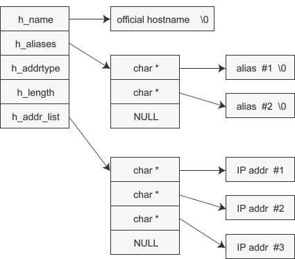

示例程序：　[host_service_info.c](./socket-api/host_service_info.c)


需要指出的是，上面讨论的4个函数都是不可重物，即在线程安全的。不过netdb.h头文件给出了它们的可重入的版本。这些可重入的版本是在原函数的尾部加上`_r`(re-entrant)。

另外还有两个函数是将上面的4个函数包起来了，同时提供IP地址、端口号与它们对应的主机名与服务名之间的转换。

```c
# include <netdb.h>
struct addrinfo {
    int ai_flags;
    int ai_family; // 地址族
    int ai_socktype; // SOCK_STREAM或SOCK_DGRAM
    int ai_protocol; // 和socket创建的第3个参数相同，一般设置为0
    socklen_t ai_addrelen; // socket地址ai_addr的长度
    char* ai_canoname; // 主机的别名
    struct sockaddr* ai_addr; // 指向socket地址
    struct addrinfo* ai_next;   // 指向链表的下个结点
};

int getaddrinfo(const char *hostname, const char *service, const struct addrinfo *hints, struct addrinfo** result);
void freeaddrinfo(struct addrinfo *res);

int getnameinfo(const struct sockaddr *sockaddr, socklen_t addrlen, char *host, socklen_t hostlen, char *rerv, socklen_t servlen, int flags);
```
其中`ai_flags`可以设置多种标志组合，来控制上面两个函数的行为。


## .8. 高级IO函数

Linux提供了很多高级的I/O函数，它们并不像Linux基础I/O函数(比如open/read)那么常用，但在特定的条件下却表现出优秀的性能。大概可以分为下面三类：
- 用于创建文件描述符的函数，包括`pipe`和`dup/dup2`函数。
- 用于读写数据的函数，包括`readv/writev`、`sendfile`、`mmap/munmap`、`splice`和`tee`函数。
- 用于控制I/O行为和属性的函数，包括`fcntl`函数。

### .8.1. `pipe`: 用于创建一个进程间通信的管道

```c
/// @brief 创建一个单向通信的管道，fd[0]和fd[1]构成了管道的两端
/// fd[0]用于读取数据，fd[1]用于发送数据，不能反向使用
/// 如果要实现双向数据传输，就必须创建两个通道
/// @param[in&out] fd 包含两个整数的数组指针，存放一对打开的文件描述符
/// @return 成功时返回0，失败时返回-1并设置errno
# include <unistd.h>
int pipe(int fd[2]);
```

默认创建的管道是阻塞式的，当没有数据从`fd[1]`写入时，如果从`fd[0]`中读取数据就会阻塞。而如果数据一直不从`fd[0]`读取，而一直往`fd[1]`写入时，会导致管道被塞满，这里对`fd[1]`的写入就会被阻塞。自Linux 2.6.11内核起，管道容量的大小默认是65536字节。

如果管道的写入端`fd[1]`关闭（引用计数降为0）后，再从`fd[0]`读取数据，则`read`操作将返回0，即读取到了文件结束标记（End Of File `EOF`）；反之，如果官道的读取端`fd[0]`关闭后，再对`fd[1]`执行`write`调用，则会返回失败，并引发`SIGPIPE`信号。

Linux的socket　API中提供了一个`socketpair`函数。它能够方便地创建双向管道。其定义如下：

```c
# include <sys/types.h>
# include <sys/socket.h>
/// @brief 创建一个双向管道
/// @param[in] domain 如socket创建参数，但这里只使用UNIX本地协议族AF_UNIX
/// @param[in] type 如socket创建参数
/// @param[in] protocol 如socket创建参数
/// @param[in] fd 管道两端的文件描述符，与pipe不同的这两个文件描述符同时支持读和写
int socketpair(int domian, int type, int protocol, int fd[2]);
```

`pipe`的示例程序：[test_pipe.c](./socket-api/test_pipe.c)

### .8.2. Linux内核是如何打开文件的

内核用三个相关的数据结构来表示打开的文件：
- 描述符表（descriptor table）:每个进程都有它独立的描述符表，每个打开的文件用它的文件描述符在表中的索引，每个表项的内容是一个指向文件表的指针。
- 文件表(file table)。整个内核打开文件的集合是由一张文件表来表示的，所有进程共享这张表。它的每个表项包含了当前文件位置、引用计数，以及一个指向`v-node`表中对应表项的指针等。关闭一个描述符会减少相应的文件表项中引用计数。内核不会删除这个文件表表项，直到它的引用计数为零。
- `v-node`表。同文件表一样，所有进程共享这张`v-node`表。每个表项包含`stat`结构中的大多数信息，比如`st_mode`和`st_size`等。

我们先来看一下正常情况下，没有文件共享时，如下图：描述符1和4通过不同的打开文件表表项来引用两个不同的文件。

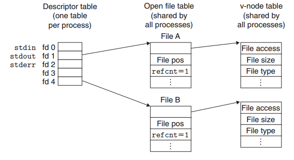

下面这符图描述的是：多个描述符通过了不同的文件表表项来引用同一个文件。这种情况也很常用，比如我们在一个进程中对一个文件打开两次，获得两个描述符，通过这两个描述符，我们可以对文件不同的位置进行操作。

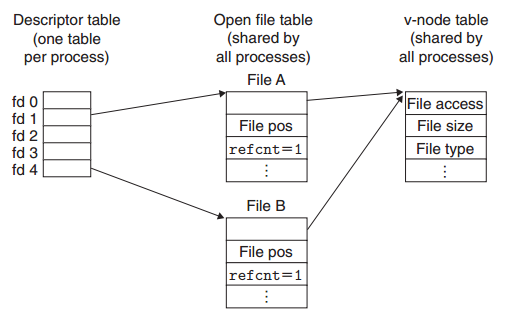

然后我们再看一下父子进程是如何共享文件的。假设在`fork`之前，进程中打开文件的情况如第一幅图。当调用`fork`后，子进程完全复制了父进程`PCB`中的内容，因此父子进程打开了同样的文件，共享了相同的文件位置。但是引用计数加1了。

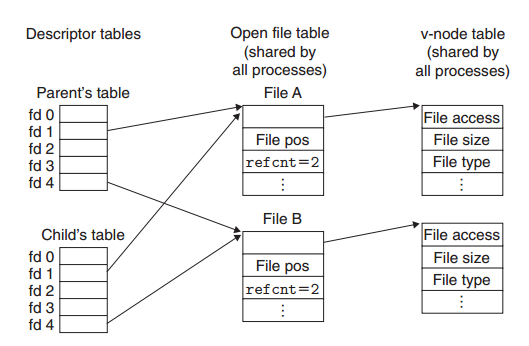


### .8.3. `dup`/`dup2`: 复制文件到新的描述符

```c
# include <unistd.h>
/// @brief dup创建一个新的文件描述符，该新的文件描述符和原有的文件描述符oldfd
/// 指向相同的文件、管道或者网络连接。并且dup返回的文件描述符总是取系统当前可用的最小的整数值
/// @return 调用成功，则返回正确的文件描述符值，调用失败，则返回-1并设置errno
int dup(int oldfd);

/// @brief dup2函数复制描述符表表项oldfd到描述符表项newfd，覆盖描述符表表项new-fd以前的内容。
/// 如果newfd已经打开了，dup2会复制oldfd之前关闭newfd。
/// @return 调用成功，则返回正确的文件描述符值，调用失败，则返回-1并设置errno
int dup2(int oldfd, int newfd);
```

用下图来示例的话，假设调用`dup2(4,2)`前，我们的状态是上面的第一张图所示。其中描述符1(标准输出)对应文件A（比如一个终端），描述符4对应于文件B(比如一个磁盘文件)。A和B的引用计数等于1，当调用了`dup2(4,2)`后。两个描述符现在定位到的同样的文件表表项。而且文件B的引用计数增加。文件A将会被关闭，它的文件表和`v-node`表表项都会被删除。

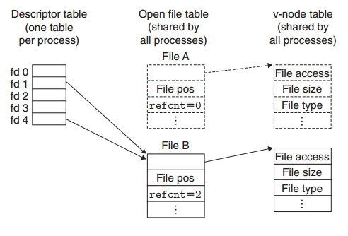

> Tips: 通过`dup`和`dup2`创建的文件描述符并不继承原文件描述符的属性，比如`close-on-exec`和`non-blocking`等。

`dup`示例程序：[test_dup.c](./socket-api/test_dup.c)

### .8.4. `readv`/`writev`: 读写分散的数据块

```cpp
# include <sys/uio.h>
/// @brief 将数据从文件描述符读到分散的内在块中
/// @param[in] fd 进行读取的文件描述符
/// @param[in] vector 类型为iovec的分散内存
/// @param[in] count 分散内存的块数
/// @return 调用成功时，返回读取到的字节数，失败时返回-1并设置errno
ssize_t readv(int fd, const struct iovec* vector, int count);

/// @brief 将分散在不同内在块中的数据集中写到文件描述符中
/// @param[in] fd 进行写入的文件描述符
/// @param[in] vector 类型为iovec的分散内存
/// @param[in] count 分散内存的块数
/// @return 调用成功时，返回写入的字节数，失败时返回-1并设置errno
ssize_t writev(int fd, const struct iovec* vector, int count);
```

### .8.5. `sendfile`: 零拷贝发送传输文件

```cpp
# include <sys/sendfile.h>
/// @brief 在两个文件描述符之间直接传递数据（完全在内核中操作），
/// 从而避免了内核缓冲区和用户缓冲区之间的数据拷贝
/// @param[in] out_fd 待写入内容的文件描述符
/// @param[in] in_fd 待读出内容的文件描述符
/// @param[in] offset 指定了从in_fd中哪个位置开始读
/// @param[in] count 指定了in_fd和out_fd之间传输的字节数
/// @return 成功时，返回实际传输的字节数，失败时返回-1并设置errno
ssize_t sendfile(int out_fd, int in_fd, off_t* offset, ssize_t count);
```

>Tips: `in_fd`必须是一个支持类似`mmap`函数的文件描述符，即它必须指向真实的文件，而不能是`socket`和管道；而`out_fd`则必须是一个`socket`。由此可见`sendfile`几乎是专门为网络上传输文件而设计的。

### .8.6. `mmap`/`munmap` `todo`

在CSAPP的内存管理的部分详细介绍

### .8.7. `splice`: 在两个文件之间移动数据


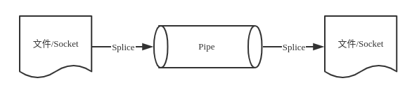

```cpp
// 关于_GNU_SOURCE的说明：https://stackoverflow.com/a/5583764
# define _GNU_SOURCE 
# include <fcntl.h>
/// @brief splice用于在两个文件描述符之间移动数据，也是零拷贝操作
/// @param[in] fd_in 待输入数据的文件描述符，如果fd_in是一个管道描述符，那么off_in必须为NULL
/// @param[in] off_in 表示输入数据流的何处开始读取数据，**相对于文件读取位置的偏移**
/// 如果设置为NULL，表示从当前偏移位置读入
/// @param[in] fd_out 待输出数据的文件描述符
/// @param[in] off_out 表示从输出数据流的何处开始写入数据，意义同off_in
/// @param[in] len 要移动的数据的大小
/// @param[in] flags 控制如何移动
/// @return 调用成功时返回移动字节的数据，它可能是0(从空管道中读取数据)，调用失败，则返回-1并设置errno
ssize_t splice(int fd_in, loff_t* off_in, int fd_out, loff_t* off_out, size_t len, unsigned int flags);
```

使用`splice`时`fd_in`和`fd_out`必须有一个为管道文件描述符。

使用`splice`进行文件拷贝的示例程序：[copyfile_splice.c](./socket-api/copyfile_splice.c)

### .8.8. `tee`: 管道文件描述符之间复制数据

```cpp
# include <fcntl.h>
/// @brief tee用于在两个管道文件描述符之间复制数据
/// 它并不会消耗掉数据，只是拷贝，它也是零拷贝的
/// @param[in] pipefd_in  待输入数据的管道文件描述符
/// @param[in] pipefd_out 待输出数据的管道文件描述符
ssize_t tee(int pipefd_in, int pipefd_out, size_t len, unsigned int flags);
/// @param[in] len 拷贝数据的长度
/// @param[in] flags控制拷贝数据的行为，同splice
```

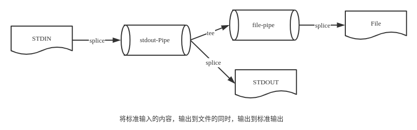

示例代码：[stdin2_stdout_and_file.c](./socket-api/stdin2_stdout_and_file.c)

### .8.9. `fcntl`: 控制文件描述符的属性与行为

`todo`

## .9. Linux服务器程序规范

- Linux服务器程序一般以后台进程形式运行。后台进程以称守护进程（daemon）。它没有控制终端，因为不会意外收到用户的输入。守护进程的父进程通常是init进程（PID为1的进程）。
- Linux服务器程序通常有一套日志系统，它至少能输出日志到文件，有的高级服务器还能输出日志到专门的UDP服务器。大部分的后台进程都在`/var/log`目录下有拥有自己的日志目录。
- Linux服务器程序一般以某个专门的非root身份运行。比如`mysqld`、`httpd`、`syslogd`等后台程序，分别拥有自己的运行账号`mysql`、`apache`和`syslog`。
- Linux服务器程序通常是可配置的。服务器程序通常能处理很多命令行选项，如果一次运行的选项太多，则可以用配置文件来管理。绝大多数的服务器程序都有配置文件，并存放在`/etc/`目录下。
- Linux服务器进程通常会在启动的时候生成一个PID文件并存放`/var/run`目录中，以记录该后台进程的`PID`。比如`syslog`的`PID`文件是`/var/run/syslogd.pid`。
- Linux服务器程序通常要考虑系统资源和限制，以预测自身能承受多大的负荷，比如进程可用文件描述符的总数与内存总量。


### .9.1. Linux系统日志

现在的Linux系统上使用了`rsyslogd`守护进程来处理系统日志，它既能接收用户进程输出的日志，又能接收内核日志。用户可以通过`syslog`函数生成系统日志，该函数将日志输出到一个UNIX本地域socket类型(`AF_UNIX`)的文件`/dev/log`中，`rsyslogd`则监听该文件以获取用户进程的输出。内核日志由`printk`等函数打印至内核的环状缓冲(`ring buffer`)中。环状缓存的内容直接映射到`/proc/kmsg`文件中。`rsyslogd`则通过读取该文件获取内核日志。

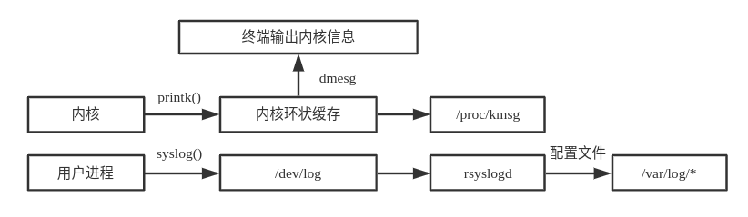

`syslogd`守护进程在接收到用户或内核输出的日志后，会把它们输出至某些特定的日志文件。

默认情况下，调试信息则保存至`var/log/debug`文件，普通信息保存至`var/log/messages`文件，内核消息则保存至`var/log/kern.log`文件。

不过，日志信息具体如何分发，可以在`rsyslogd`的配置文件中设置。`rsyslogd`的主配置文件是`/etc/rsyslog.conf`。

```cpp
# include <syslog.h>

// 系统日志的priority
# define LOG_EMERG       0 // 系统不可用
# define LOG_ALERT       1 // 报警，需要立即采取动作
# define LOG_CRIT        2 // 非常严重的情况
# define LOG_ERR         3 // 错误
# define LOG_WARNING     4 // 警告
# define LOG_NOTICE      5 // 通知
# define LOG_INFO        6 // 信息
# define LOG_DEBUG       7 // 调试

/// @brief 输出系统日志
/// @param[in] priority 用于设置日志级别，从DEBUG到EMERG等
/// @param[in] fmt 格式化日志输出
void syslog(int priority, const char *fmt, ...);

// logopt的可配选项
# define LOG_PID     0x01 // 在日志消息中包含程序PID
# define LOG_CONS    0x02 // 如果消息不能记录到日志，则打印至终端
# define LOG_ODELAY  0x04 // 延迟打开日志功能直到第一次调用syslog
# define LOG_NDELAY  0x08 // 不延迟打开日志功能

/// @brief 改变syslog的默认输出方式，进一步结构化日志内容
/// openlog是可选的，如果没调用，则syslog会自动的调用，创建unix本地socket
/// @param[in] ident参数指定的字符串将被添加到日志消息的日期和时间之后，它通常设置为程序的名字。
/// @param[in] logopt参数对后续syslog调用行为进行配置
/// @param[in] facility参数用于修改syslog函数中的默认设施值
void openlog(const char* ident, int logopt, int facility);

/// @brief 设置日志的过滤位
/// @param[in] maskpri用于指定哪些级别的日志被输出
/// 一般需要和LOG_MASK和LOG_UPTO两个宏结合来使用
/// LOG_MASK(pri) 则只输出pri级别的日志
/// LOG_UPTO(pri) 则只输出比pri小于或等于级别的日志
/// 大于maskpri的日志等级将被过滤掉
int setlogmask(int maskpri);

/// @brief 关闭系统日志，使用closelog是可选的，它会关闭syslog内部的套接字描述符
/// closelog如果再调用syslog，会再次打开本地UNIX套接字
void closelog();
```

`syslog`的使用示例：[test_syslog.c](./socket-api/test_syslog.c)

### .9.2. 程序的用户身份

Linux程序的用户信息对Linux的安全是很重要的，比如很多Linux程序是给系统管理员管理系统来使用的，如果以普通用户的身份去使用，就会因为权限问题而报错。有的程序是别的用户创建或生成的，那么其他用户可能就没有权限去运行。

但有些程序虽然是`root`账户创建的，但是却需要允许普通用户执行，而且这些程序在运行过程中需要访问一些`root`权限的文件。

比如`passwd`程序，这个程序的所有者是`root`，它的核心功能实际是修改`/etc/passwd`文件。但它的功能是提供给一般用户修改自己密码的功能，所以它一方面需要允许普通用户执行，但同时又能访问到普通用户没有权限直接访问的文件。

下面做个简单的实验，程序如下：L

```cpp
# include <sys/types.h>
# include <unistd.h>
# include <stdio.h>
# include <fcntl.h>

# include "utils.h"

int main(int argc, char *argv[]) {
    uid_t uid = getuid();
    uid_t euid = geteuid();

    printf("userid is %d, effective userid is: %d\n", uid, euid);

    int ret = open("/etc/passwd", O_RDWR);
    if (0 != ret) {
        exit_with_errno(-1);
    }
    return 0;
}
```
如果以普通用户身份，编译运行这个程序，则会打印如下的信息：
```txt
userid is 1000, effective userid is: 1000
Permission denied
```
可以看到，由于是程序的有效用户id是1000，所以它没有权限以`读写`权限来打开`/etc/passwd`文件。

下面我们改变该测试程序的有效用户为`root`
```bash
sudo chown root:root test_user_id #修改目标文件所有者为root
sudo chmod +s test_user_id # 设置目标文件的set-user-id标志
```
再次运行程序，我们可以看到下面的结果：
```txt
userid is 1000, effective userid is: 0
Success
```
这里面如果我们不执行`chomd +s`，那么这个可执行程序拥有者虽然变成了`root`，但当我们以普通用户执行时，它的`useid`和`euid`依然是普通用户的id。所以依然没有权限打开`/etc/passwd`文件。

Linux提供了一组获取与设置用户ID、用户有效ID、用户组ID、用户有效组ID的函数。

```cpp
uid_t getuid();             // 获取真实用户ID
uid_t geteuid();            // 获取有效用户ID
gid_t getgid();             // 获取真实用户组ID
gid_t getegid();            // 获取有效用户组ID
int setuid(uid_t uid);      // 设置真实用户ID
int seteuid(uid_t euid);    // 设置有效用户ID
int setgid(gid_t gid);      // 设置真实用户组ID
int setegid(gid_t egid);    // 设置有效用户组ID
```

### .9.3. 进程间的关系

**进程组**

Linux下面每个进程都隶属于一个进程组，因此它除了`PID`信息外，还有进程组ID(`PGID`)。我们可以用如下函数来获取或设定指定进程的`PGID`:

```cpp
# include <unistd.h>
/// @brief 获取指定进程的进程组ID
/// @param[in] pid 用于指定进程
/// @return 返回指定进程的进程组的组ID，如果调用失败，则返回-1，并设置errno
pid_t getpgid(pid_t pid);


/// @brief 将进程pid的进程组ID设置为pgid
/// 如果pid与pgid相同，则pid进程将成为首领进程
/// 如果pid为0，则代表设置的是本进程
/// 如果pgid为0，则使用pid作为目标PGID
/// 一个进程只能设置自己或其子进程的PGID，但当子进程双创建子进程后，就不能被其父进程设置PGID了
/// @param[in] pid 被设置的进程的进程ID
/// @param[in] pgid　指定的进程组ID
/// @return 调用成功，则返回0，失败则返回-1并设置errno
int setpgid(pid_t pid, pid_t pgid);
```

每个进程组都有一个首领进程，其`PGID`和`PID`相同。进程组将一直存在，直到其中所有的进程都退出，或者加入其他进程组。

**会话**

一些有关联的进程组将形成一个会话(session)。下面的函数用于创建一个会话：
```cpp
# include <unistd.h>
/// @brief 创建一个新的会话
/// 该函数只能被非首领进程调用
/// 对于非首领进程，调用该函数的具体效果如下：
/// 会新建一个进程组，新的进程组的组ID就是调用进程的pid
/// 调用进程成为该会话的首领，同时也是进程组的首领
/// 调用进程将甩开终端（如果有的话）
/// @return 调用成功，则返回新的进程组的PGID，失败则返回-1并设置errno
pid_t setsid(void);

/// @brief 获取会话首领所在的进程组的PGID
pid_t getsid(pid_t pid);
```

Linux进程并未提供所谓会话ID（SID）的概念。

**用ps命令查看进程关系**

```bash
ps -o pid,ppid,pgid,sid,comm | less
```

打印内容如下：
```txt
  PID  PPID  PGID   SID COMMAND
 5502  5343  5502  5502 bash
12480  5502 12480  5502 ps
12481  5502 12480  5502 less
```

用下面的图来描绘`bash`、`ps`、`less`三个进程之间的关系。

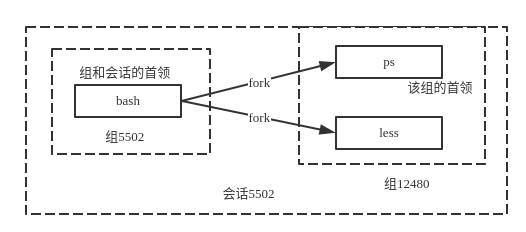

`todo`：进程组和会话的意义是什么，为什么Linux在进程基础上加了这些概念？

### .9.4. 系统资源限制

Linux上运行的程序都会受到资源限制的影响，比如物理设备限制（CPU数量、内存数量等）、系统策略的限制（被调度的CPU时间等），以及具体实现的限制（比如文件名的最大长度）。Linux系统资源限制可以通过如下一对函数来读取和设置。

```cpp
# include <sys/resource.h>
/// @brief 获取进程的资源限制情况
/// @param[in] resource 被指定资源类型
/// @param[out] rlim 具体的限制情况（软限制和硬限制）
/// @return 调用成功则返回0，否则返回-1并设置errno
int getrlimit(int resource, struct rlimit *rlim);

/// @brief 设定进程的的资源限制
/// @param[in] resource 被指定资源类型
/// @param[in] rlim 具体的限制情况（软限制和硬限制）
/// @return 调用成功则返回0，否则返回-1并设置errno
int setrlimit(int resource, const struct rlimit *rlim);

/// @brief 描述资源限制的结构
struct rlimit {
    rlim_t rlim_cur; // 指定资源的软限制
    rlim_t rlim_max; // 指定资源的硬限制
}
```

`rlim_t`是一个整数类型。它描述资源限制级别。软限制是一个建议性的、最好不要超越的限制，如果超越的话，系统可能向进程发送信号以终止其运行。
硬限制一般是软限制的上限，普通程序可以减小硬限制，而只有以root身份运行的程序才能增加硬限制。

除了调用接口的方法来改变当前进程的资源限制外，我们还可以在终端上调用`ulimit`命令来修改当前`shell`环境下的资源限制（软限制/硬限制），这种修改将对该shell启动的所有后续程序有效。

我们还可以通过修改配置文件来改变系统的软硬限制，而且这种修改是永久有效的。

resource参数可以指定的资源类型列表如下：

资源限制类型 | 含义
---|---
RLIMIT_AS | 进程产生虚拟内在总量限制（单位是字节），超过该限制将使得某些函数（比如mmap）产生ENOMEM错误。
RLIMIT_CORE | 进程核心转储文件（core dump）的大小限制（单位是字节）。其值为0代表不产生核心转储文件。
RLIMIT_CPU | 进程CPU时间限制（单位是秒）
RLIMIT_DATA | 进程数据段（初始化数据data段、未初始化的bss段和堆栈）限制（单位是字节）
RLIMIT_FSIZE | 文件大小限制（单位是字节），超过该限制将使得某些函数（比如write）产生EFBIG错误
RLIMIT_NOFILE | 文件描述符限制，超过该限制将使得某些函数（比如pipe）产生EMFILE错误
RLIMIT_NPROC | 用户能创建的进程数限制，超过该限制将使得某些函数（比如fork）产生EAGAIN错误。
RLIMIT_SIGPENDING | 用户能够挂起的信号数量限制
RLIMIT_STACK| 进程栈内存的限制（单位是字节），超过该限制将引起SIGSEGV信号

### .9.5. 改变工作目录与根目录

```cpp
# include <unistd.h>
/// @brief 获取进程当前工作目录
/// @param[out] buf 指向的内存用于存储进程当前工作目录的绝对路径名，结束会再附上一个结束符'\0'
/// 如果buf设置为空，而size非0，则getcwd可能在内部使用malloc动态分配内存，将这段内存返回，这里就需要手动在外部释放这部分的空间
/// @param[in] size　buf的大小
/// @return 如果当前目录的绝对路径（包括结束符）长度超过了size
/// 将返回NULL，并设置errno
char *getcwd(char *buf, size_t size);
/// @brief　改变进程的当前工作目录
/// @param[in] path 指向要切换到的工作目录
/// @return 成功则返回0，失败时返回-1并设置errno
int chdir(const char* path);

/// @brief 改变进程的根目录
/// 比如HTTP服务器，它的根目录真实路径一般为`/var/www/`
/// 只有特权进程才可以调用该函数
/// @param[in] path指向改变到的根目录
/// @return 成功则返回0，失败时返回-1并设置errno
/// @note 调用chroot后，会导致原来的一些位置变成不可访问
/// 如果/var/log日志目录，因为根目录的真实位置已经变了
/// 这时访问/var/log实际相当于path/var/log
int chroot(const char* path);
```

### .9.6. 服务器程序后台化

守护进程最重要的特性是后台运行。守护进程必须与其运行前的环境隔离开来。这些环境包括**未关闭的文件描述符**、**控制终端**、**会话**和**进程组**、**工作目录**以及**文件创建掩码**等。

这些环境通常是守护进程从执行它的父进程(特别是`shell`)继承下来的。最后，守护进程的启动方式有其特殊之处。它可以在Linux系统启动时从启动脚本`/etc/rc.d`中启动，也可以由作业控制进程`crond`启动，还可以由用户终端(通常是`shell`)执行。

所以使一个进程成为守护进程一般需要执行下面的操作：

1. **创建子进程，终止父进程**。由于守护进程是脱离控制终端的，因此首先创建子进程，终止父进程，使得程序在shell终端里造成一个已经运行完毕的假象。之后所有的工作都在子进程中完成，而用户在shell终端里则可以执行其他的命令，从而使得程序以僵尸进程形式运行，在形式上做到了与控制终端的脱离。
2. **在子进程中创建新会话**。这个步骤是创建守护进程中最重要的一步，在这里使用的是系统函数setsid。
`setsid`函数用于创建一个新的会话，并担任该会话组的组长。调用`setsid`的三个作用：让进程摆脱原会话的控制、让进程摆脱原进程组的控制和让进程摆脱原控制终端的控制。在调用`fork`函数时，子进程全盘拷贝父进程的会话期(session，是一个或多个进程组的集合)、进程组、控制终端等，虽然父进程退出了，但原先的会话期、进程组、控制终端等并没有改变，因此，那还不是真正意义上使两者独立开来。`setsid`函数能够使进程完全独立出来，从而脱离所有其他进程的控制。
3. **改变工作目录**。使用`fork`创建的子进程也继承了父进程的当前工作目录。由于在进程运行过程中，当前目录所在的文件系统不能卸载，因此，把当前工作目录换成其他的路径，如`/`或`/tmp`等。改变工作目录的常见函数是`chdir`。
4. **重设文件创建掩码**。文件创建掩码是指屏蔽掉文件创建时的对应位。由于使用`fork`函数新建的子进程继承了父进程的文件创建掩码，这就给该子进程使用文件带来了诸多的麻烦。因此，把文件创建掩码设置为0，可以大大增强该守护进程的灵活性。设置文件创建掩码的函数是`umask`，通常的使用方法为`umask(0)`。

Linux提供了`daemon`函数来完成进程的后台化运行。

```cpp
# include <unistd.h>
/// @brief 将当前进程后台化
/// @param[in] nochir 用于说明是否改变工作目录，如果给它传递0，则工作目录将被设置为`/`根目录，否则继续使用当前目录。
/// @param[in] noclose 参数为0时，标准输入/输出和错误都会被重定向到`/dev/null`文件，否则依然使用原来的设备。
/// @return 调用成功返回0，失败则返回-1并设置errno
int daemon(int nochdir, int noclose);
```

## .10. IO多路复用

## .11. 网络信号处理

## .12. 定时器